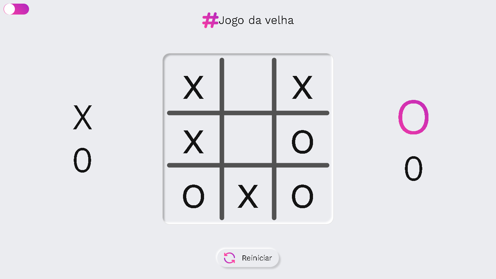
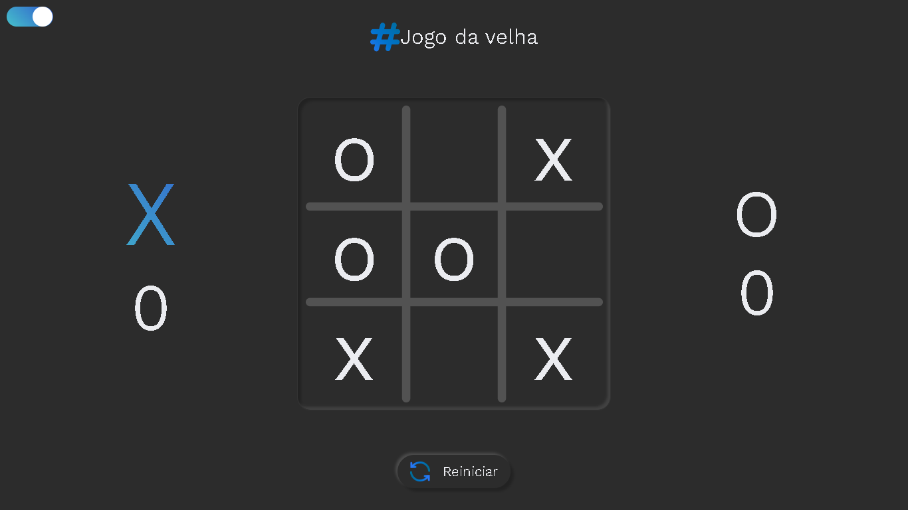

---


  - [Descrição](#descrição)
  - [Funcionalidades](#funcionalidades)
  - [Construido com](#construido-com)
  - [Como executar o projeto](#como-executar-o-projeto)
  - [Screenshots](#screenshots)
  - [Testes](#testes)
  - [Links](#links)
  - [Autor](#autor)

---
  ### Descrição:
  - Este é um simples jogo da velha desenvolvido em React. É uma implementação clássica do jogo em que dois jogadores alternam entre "X" e "O" para marcar as casas no tabuleiro. O objetivo é conseguir três marcas em linha horizontal, vertical ou diagonal.
  
---
  ### Funcionalidades:
  - Interface interativa e intuitiva.
  - Indicação do jogador atual em destaque.
  - Contador de vitórias.
  - Modo noturno.
---
  ### Construido com
  - [React](https://react.dev/)
  - [Styled-components](https://styled-components.com/)
  - [Material-UI](https://mui.com/)
  - [Vite](https://vitejs.dev/)
---
  ### Como executar o projeto:
  - Clone o repositório em sua maquina
  - Abra o terminal e navegue até o diretório raiz do projeto
  - Execute os seguintes comandos:
  ```
     npm install
     npm run dev
  ```
  - Será indicado no terminal o link para acessar o projeto em seu navegador.
---
  ### Screenshots:

  
  

---
  ### Links:
- PageSpeed Insights: [Vizualizar insights]()
- Deploy: [Vizualizar projeto]()
---
  ### Autor:
  - Github - [@Natanalpe](https://github.com/natanalpe)
  - Linkedin - [Natan Altomar Pereira](https://www.linkedin.com/in/natanalpe14/)
